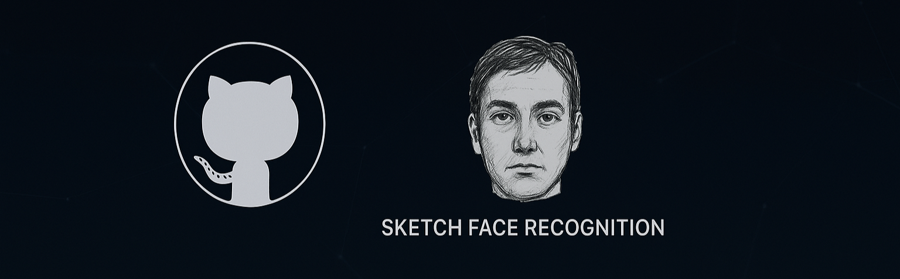
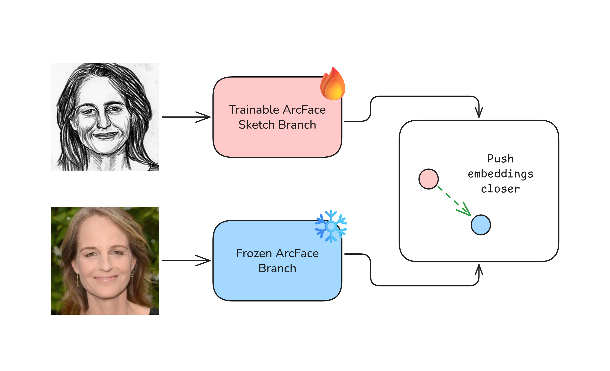
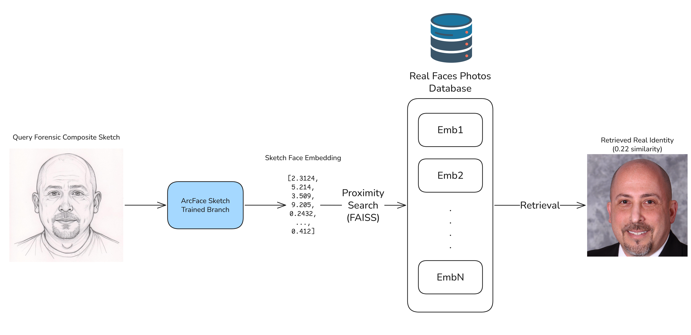
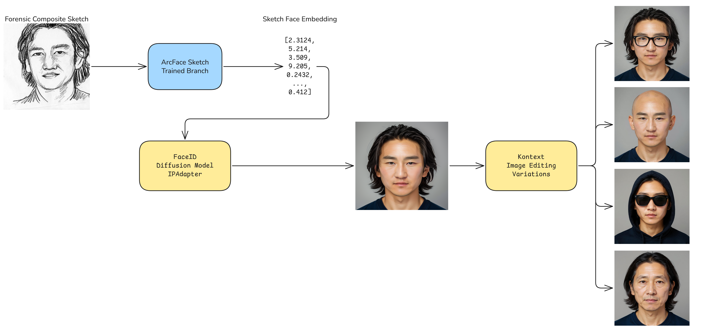

## SketchRecognition: Sketch-to-Face Retrieval and Reconstruction



SketchRecognition is a sketch-to-face recognition and reconstruction system that bridges forensic sketches with standard face recognition pipelines. It trains a dedicated sketch encoder that maps sketches into the ArcFace embedding space while keeping ArcFace unchanged. As a result, you can query any existing ArcFace face database directly with a sketch—no re-indexing required.

From a single photo–sketch pair per identity (augmented through strong sketch transforms), the model learns to align sketches and photos in the same space, enabling sketch-based retrieval of suspects. Beyond retrieval, the sketch embedding can drive generative models (IP-Adapter + diffusion) to reconstruct photorealistic candidate faces and explore possible disguises (hoodie, sunglasses, bald, beard, aging).

### What you get
- **Drop-in sketch queries for ArcFace galleries**: Train once, then query your existing ArcFace database with a sketch.
- **Identity-preserving embeddings**: Sketch embeddings land close to their corresponding ArcFace photo embeddings.
- **Robust training**: Mean-teacher EMA, progressive unfreezing, sampled ArcFace softmax with semi-hard negatives, CORAL distribution alignment, and direct prototype regression.
- **Generative visualization**: Use the sketch embedding with IP-Adapter (FaceID / FaceID Plus) to reconstruct and explore disguise variations.

---

## Repository structure

- `train.py`: Train the sketch encoder branch to match ArcFace on unaligned sketches. Single-pair-per-identity supervision; EMA teacher; progressive backbone unfreezing. Saves checkpoints and TensorBoard logs.
- `test_model.py`: Encode a sketch and retrieve nearest photos from a directory of real faces using ArcFace. Also saves the sketch embedding to `sketch_embedding.npy`.
- `FaceID.py`: Use the sketch embedding to generate photorealistic candidates with IP-Adapter FaceID (and FaceID Plus for structural guidance) via diffusion. Works best with a guidance prompt (e.g., extracted from the sketch using ChatGPT).
- `generate_variations.py`: Given a reconstructed face (or a matched dataset image), produce realistic variations (incognito hoodie, sunglasses, bald, beard, aging, add/remove glasses) via an instruction-based image-to-image diffusion model.

---

## Quickstart

### 1) Environment

Python 3.10+ is recommended.

```bash
pip install torch torchvision --index-url https://download.pytorch.org/whl/cu121  # pick CUDA/CPU build for your system
pip install numpy pillow tqdm matplotlib onnx onnx2torch insightface open-clip-torch
pip install diffusers transformers huggingface_hub accelerate safetensors
pip install replicate python-dotenv requests
```

Notes:
- Windows/CUDA users: install a torch build compatible with your NVIDIA driver. See PyTorch install instructions.
- `insightface` may pull additional dependencies on first run.
- For diffusion models in `FaceID.py`, you may need to accept model licenses and/or set a Hugging Face token (`huggingface-cli login`).
- `generate_variations.py` uses the Replicate API; set `REPLICATE_API_TOKEN` in a `.env` file.

### 2) Prepare the dataset

Expected directory structure for training (pairs by filename stem):

```text
DATASET_ROOT/
  real/
    <identity_id_1>.jpg
    <identity_id_2>.png
    ...
  sketch/
    <identity_id_1>.png
    <identity_id_2>.png
    ...
```

Rules:
- Each file in `real/` must have a matching filename stem in `sketch/` (extensions may differ). Example: `real/abc123.jpg` ↔ `sketch/abc123.png`.
- Only one pair per identity is required. Strong sketch augmentations supply intra-class variation.

### 3) Get the ArcFace ONNX

Download the exact ArcFace backbone from the InsightFace buffalo_l package (`w600k_r50.onnx`) and set its path in the config. For example:

```text
D:\hf\hub\w600k_r50.onnx
```

The training and evaluation pipelines assume this exact model to maintain embedding compatibility.

---

## Training the sketch encoder (`train.py`)



Run:

```bash
python train.py
```

Edit the config at the top of `train.py` (`class Config`) to match your setup:

- **Data paths**
  - `dataset_path`: Root folder with `real/` and `sketch/`.
  - `arcface_onnx`: Path to `w600k_r50.onnx`.
  - `out_dir`: Output folder for logs and checkpoints (e.g., `./runs/sketch2arcfacev2`).

- **Training**
  - `batch_size`, `epochs`, `fp16`, `accum_steps`, `grad_clip_norm`.
  - Learning rates: `lr_head`, `lr_backbone`; `wd`.
  - Schedules: `warmup_steps`, cosine decay (`cosine_final_lr_mul`).
  - Angular margin softmax: `scale_s`, `margin_m`, and `sampled_softmax_classes`.
  - Regularizers: `lambda_consistency`, `lambda_coral`, `lambda_reg`.
  - Evaluation negatives per query: `val_negatives_per_query`.
  - Gradual unfreezing: `unfreeze_after_steps`, `unfreeze_last_blocks`.
  - Checkpointing/logging: `log_every`, `eval_every_epochs`, `save_best`, `resume`.

### How it works

1) **ArcFace teacher (frozen)**
- Loads the exact `w600k_r50.onnx` and converts to PyTorch. Photos are aligned to the ArcFace 112×112 template using InsightFace 5-point landmarks (graceful fallback to centered crop).
- Precomputes L2-normalized 512-D ArcFace photo prototypes for all identities and caches them at `DATASET_ROOT/arcface_prototypes.npz` (auto-recomputed on mismatch).

2) **Sketch encoder (student)**
- Visual backbone: OpenCLIP image tower (default `ViT-B-16`) with a projection head to 512-D. Output is L2-normalized.
- Frozen backbone initially; progressively unfreeze the last N transformer blocks after a warmup (`unfreeze_after_steps`), dynamically extending the optimizer and scheduler.

3) **Augmentations (sketch)**
- Two stochastic views per sketch per iteration: a weak and a strong pipeline with geometric distortions, slight photometric variations, and optional inversion—all CLIP-normalized to 224×224.

4) **Losses and schedules**
- Primary: **ArcFace sampled softmax** with true angular margin. Always includes all positives, then fills with random and semi-hard negatives (top-k per mini-batch) up to `sampled_softmax_classes`.
- **Mean-teacher consistency**: EMA teacher of the student predicts the weak view; student predicts the strong view; minimize 1 − cosine.
- **Prototype regression**: Direct cosine regression of strong-view sketch embedding to the ArcFace class prototype.
- **CORAL** distribution alignment: Match mean and covariance of current sketch embeddings to a random sample of ArcFace prototypes.
- **Schedules**:
  - `s` and `m` ramp-up: `s: 16 → scale_s`, `m: 0 → margin_m` over ~2×warmup steps.
  - EMA decay ramps `0.996 → 0.999` over ~10 epochs.
  - Consistency weight decays after unfreezing.

5) **Optimization**
- AdamW with separate LR for head and (later) unfrozen backbone blocks.
- Mixed precision (`fp16`) and gradient accumulation (`accum_steps`) for large effective batch sizes.
- Gradient clipping for stability.

6) **Evaluation**
- Computes Recall@1 versus the full prototype gallery and a val-only gallery, plus verification TPR at fixed FPR (1e-2, 1e-3) with sampled negatives.

7) **Logging and checkpoints**
- TensorBoard scalars written to `out_dir`. On Windows/cloud-drive quirks, the script auto-falls back to a local temp directory to ensure live TB updates.
- Saves `last.pth` each epoch and `best.pth` by val-only Recall@1.

### Outputs
- `runs/sketch2arcfacev2/last.pth` and `best.pth` containing:
  - Model weights, EMA teacher, optimizer/scheduler state, global step, best val metric, and class index maps.
- TensorBoard logs in `out_dir` (or fallback dir), ready to view:

```bash
tensorboard --logdir runs/sketch2arcfacev2
```

---

## Retrieval and embedding export (`test_model.py`)



Purpose:
- Load the finetuned sketch encoder, encode a query sketch, and retrieve the most similar faces from a folder of real photos (embedded with ArcFace).
- Save the sketch embedding to `sketch_embedding.npy` for downstream generation.

Edit the top of `test_model.py`:
- `SKETCH_PATH`: Path to the sketch image.
- `FFHQ_DIR`: Folder with real photos to search (any folder of images works).
- `MAX_GALLERY`: Number of gallery images to embed and search (e.g., 100).
- `CKPT_DIR`: Where your `best.pth/last.pth` live.
- `PREFER_BEST`: Whether to prefer `best.pth` over `last.pth`.

Run:

```bash
python test_model.py
```

What it does:
- Loads the sketch encoder from your checkpoint.
- Encodes the sketch with the eval transform (224, CLIP mean/std).
- Loads ArcFace (same ONNX) and embeds each gallery photo after alignment.
- Prints top-5 matches and shows a figure of results.
- Saves the sketch embedding to `sketch_embedding.npy` in the project root.

---

## Photorealistic reconstruction (`FaceID.py`)



Purpose:
- Use the identity-preserving sketch embedding with IP-Adapter FaceID to synthesize photorealistic candidate faces.
- Optionally enable FaceID Plus for structure guidance using a face image (can be the sketch or a matched dataset photo).

Key parameters in `FaceID.py`:
- `faceid_embed_npy`: Path to `sketch_embedding.npy` (written by `test_model.py`). If `image_paths` are provided instead, the script will compute the ArcFace embedding from those images.
- `plus_face_image_path`: If using only an embedding and you want FaceID Plus (stronger structural control), provide a face image here. Otherwise Plus will be disabled.
- `prompt`: Guidance text (works best if you describe age, ethnicity, hair, facial hair, glasses, etc.). You can extract such a description from the sketch using a language model.
- `negative_prompt`: Safety/quality negatives.
- `preserve_face_structure`: Switch between FaceID (v1) and FaceID Plus (v2). Plus requires a face image for `face_image` input.
- `face_strength` (Plus): Structural guidance strength (e.g., 1.6).
- `likeness_strength`: Embedding-guidance strength (e.g., 1.1).
- `arcface_onnx_path`: Path to `w600k_r50.onnx` used for embedding sanity checks.
- Output saved to `ip_adapter_output.png`.

Models downloaded on first run:
- Base diffusion model: `SG161222/Realistic_Vision_V4.0_noVAE`
- VAE: `stabilityai/sd-vae-ft-mse`
- Image encoder: `laion/CLIP-ViT-H-14-laion2B-s32B-b79K`
- Safety checker: `CompVis/stable-diffusion-safety-checker`
- IP-Adapter FaceID weights: `h94/IP-Adapter-FaceID`

Run:

```bash
python FaceID.py
```

Tips:
- Provide a detailed but neutral identity description in `prompt` (age range, ethnicity, hair length/style, facial hair, glasses, demeanor). This materially improves realism.
- If you have a reasonably aligned face image (matched dataset photo), set `plus_face_image_path` to leverage FaceID Plus for more stable structure.
- The defaults (`face_strength=1.6`, `likeness_strength=1.1`, `num_inference_steps=30`) are strong, identity-preserving settings in practice.

---

## Disguise and appearance variations (`generate_variations.py`)

Purpose:
- Starting from a reconstructed candidate (`ip_adapter_output.png`) or a real matched image, generate realistic variations to explore potential disguises or small attribute changes.

How it works:
1) Reads two base64-encoded inputs: the reconstructed face and the original sketch.
2) Uses a small multimodal model (via Replicate) to infer four boolean flags from the sketch:
   - `is_male`, `has_glasses`, `is_bald`, `has_facial_hair`.
3) Builds context-aware edit prompts (e.g., add/remove glasses, shave/add beard, bald/add hair, incognito hoodie + sunglasses, aging).
4) Calls a strong instruction-based image-to-image diffusion model to produce edited results in parallel.

Setup:
- Create a `.env` with your Replicate token:

```env
REPLICATE_API_TOKEN=your_replicate_api_token_here
```

Run (edit paths at bottom of `generate_variations.py`):

```bash
python generate_variations.py
```

Outputs:
- Saves each variation image into the `variations/` folder (e.g., `incognito.png`, `add_glasses.png`, `bald.png`, `oldify.png`).

Notes:
- You can also pass a matched dataset image instead of the reconstruction if retrieval succeeded.
- Parallel generation leverages multiple threads; failures are handled per-variation.

---

## End-to-end recipe

1) Train the sketch encoder on your paired dataset:
   ```bash
   python train.py
   ```
2) Retrieve candidates and export the sketch embedding:
   ```bash
   python test_model.py
   ```
   - Inspect top-5 matches and confirm if a suspect exists in your gallery.
3) If no clear match, reconstruct a photorealistic candidate with diffusion:
   ```bash
   python FaceID.py
   ```
4) Explore disguise/appearance variations:
   ```bash
   python generate_variations.py
   ```

---

## Design details (deep dive)

### Pair construction and caching
- Pairs are built by matching stems across `real/` and `sketch/` folders.
- ArcFace prototypes are precomputed once and cached as `arcface_prototypes.npz` with id list and a `(C,512)` matrix. On dataset changes or cache mismatch, the cache is rebuilt.

### Semi-hard negatives with sampled softmax
- Per mini-batch, the loss samples a class subset that always includes all positives, then fills remaining slots with a mix of random and semi-hard negatives (top-k similarities to current batch, excluding positives).
- Angular margin is applied to the positive logit (cos(θ + m)), scaled by `s`.

### EMA mean-teacher consistency
- An EMA copy of the student encoder predicts the weakly augmented view; the student predicts the strongly augmented view. Cosine agreement improves stability and invariance.
- EMA decay increases progressively; consistency weight decays after backbone unfreezing.

### Progressive unfreezing
- After a configurable step threshold, the last N transformer blocks of the CLIP visual backbone are unfrozen.
- The optimizer and LR scheduler are rebuilt to include the new parameter group without breaking global step alignment.

### Evaluation metrics
- Recall@1 against the full gallery and val-only gallery.
- Verification TPR at FPR thresholds (1e-2, 1e-3) using sampled negatives for efficiency.

---

## Troubleshooting

- TensorBoard logs not updating on Windows/cloud drives: `train.py` detects header-only event files and falls back to `%LOCALAPPDATA%/sketch2arcface_tb/`.
- ArcFace ONNX path: Ensure the `w600k_r50.onnx` path exists and matches the buffalo_l model. A mismatch breaks embedding compatibility.
- InsightFace alignment: If landmark detection fails, the code uses a centered crop fallback. For best results, provide reasonably frontal photos.
- Diffusion downloads: Some models require license acceptance. Use `huggingface-cli login` and check your access.
- Replicate limits: Ensure `REPLICATE_API_TOKEN` is valid. Network errors are handled per-variation; failed items become `None`.

---

## Ethics and responsible use

This project is a research tool. Forensic sketches are subjective; generated images are hypothetical. Use responsibly and comply with applicable laws and organizational policies. Do not make consequential decisions based solely on these outputs. Consider dataset bias, consent, and privacy.

---

## Citation and credits

- ArcFace / InsightFace (recognition and alignment)
- OpenCLIP (visual backbone)
- IP-Adapter FaceID / FaceID Plus (generative guidance)
- Diffusers ecosystem (Stable Diffusion, schedulers, VAE)

If you use this repository in academic work, please cite the above projects accordingly.

---

## License

This repository is provided for research purposes. Check the licenses of the third-party models and datasets you use (InsightFace, OpenCLIP, diffusion models, IP-Adapter weights, etc.).


